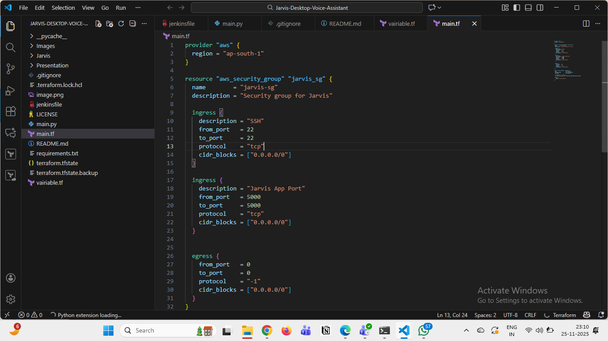
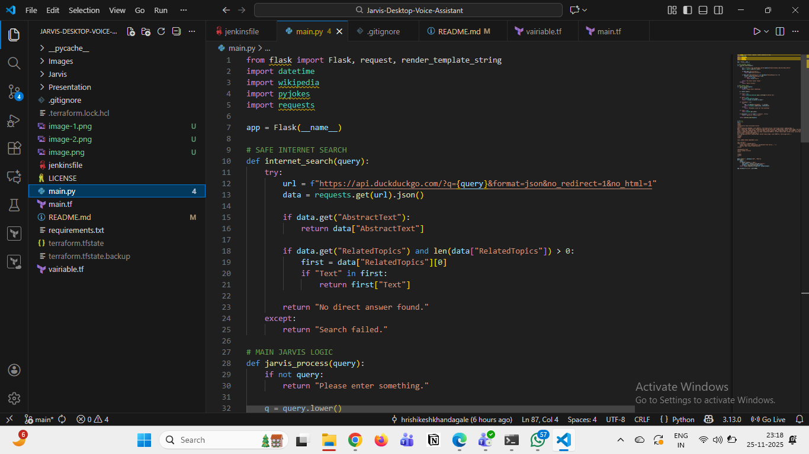
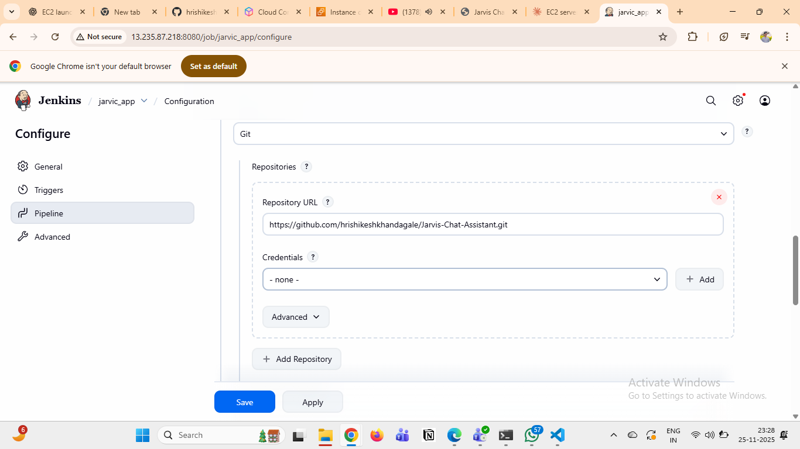
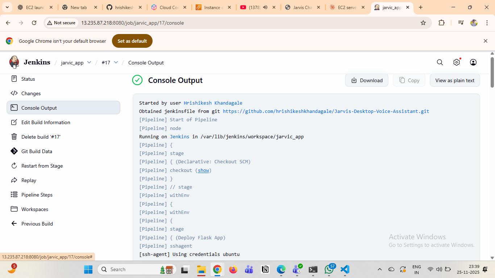
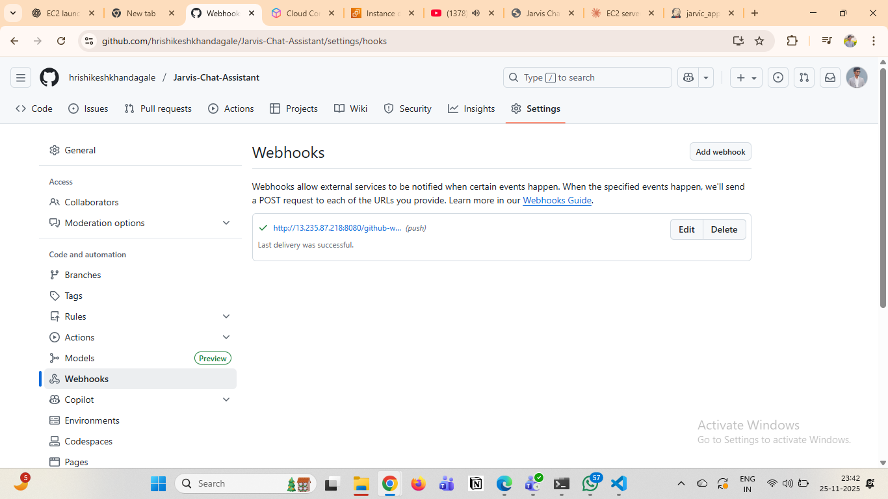

# ⚡ JARVIS CHAT ASSISTANT ⚡

A voice-enabled AI chat assistant deployed on AWS EC2 using Terraform, Jenkins CI/CD pipeline, and Flask.

## 🚀 Project Overview

JARVIS Chat Assistant is an AI-powered chatbot with a sleek interface that provides intelligent responses to user queries. The application is containerized and deployed using modern DevOps practices.

## 🏗️ Architecture

- **Infrastructure**: AWS EC2 with Security Groups (provisioned via Terraform)
- **Backend**: Python Flask application
- **CI/CD**: Jenkins pipeline for automated deployment
- **Frontend**: HTML/CSS/JavaScript 
- **Deployment**: Automated deployment to EC2 instance

## 📋 Prerequisites

- AWS Account
- Terraform installed
- Jenkins server configured
- Python 3.x
- Git

## ✅ Step 1: Launch EC2 Instance (Agent) using Terraform

In this step, we used Terraform to launch an EC2 instance and configure a security group.

### 1️⃣ Created Terraform Files

The following Terraform configuration files were created:

main.tf

variables.tf

2️⃣ Launched EC2 Instance

An EC2 instance (Amazon Linux / Ubuntu) was provisioned using Terraform.

3️⃣ Configured Security Group

A security group was created and the following inbound rules were added:

Port	Purpose
22	SSH access
5000	Flask/Python application access
4️⃣ Executed Terraform Commands

To deploy the EC2 instance and security group, the following commands were executed:

terraform init
terraform plan
terraform apply -auto-approve

After applying the Terraform configuration, the EC2 instance and security group were successfully created.

## ✅ Step 2: Created the Jenkinsfile for CI/CD Pipeline

In this step, we created a Jenkinsfile to automate the build and deployment of our Python application.

### 1️⃣ Defined the Pipeline Stages

We created a Jenkinsfile containing the following major stages:

Stage 1: Checkout Code
Pull the latest code from GitHub/GitLab.

Stage 2: Install Dependencies
Install required Python modules (Flask, wikipedia, pyjokes, etc.).

Stage 3: Deploy Application
Copy the updated code to the EC2 server and restart the Flask application

## ✅ Step 3: Added the Python Application Code (using GITHUB)

In this step, we added our main.py application code to the project repository so it can be deployed automatically through Jenkins.

### 1️⃣ Created the Python Application File (main.py)

We added a Flask-based application that returns responses for search queries, jokes, and basic assistant features.

## ✅ Step 4: Installed Flask and Required Packages on the EC2 Instance

In this step, we installed Flask and all required Python dependencies directly on the EC2 instance so the application can run successfully.

## ✅ Step 5: Created the Jenkins Pipeline Job

In this step, we created a Jenkins Pipeline job and connected it with our repository and Jenkinsfile.

### 1️⃣ Opened Jenkins Dashboard

We logged into Jenkins using:

http://13.235.87.218:8080/

### 2️⃣ Created a New Pipeline Job

Clicked “New Item”

Entered job name (e.g., Jarvis-Pipeline)

Selected Pipeline

Clicked OK

### 3️⃣ Configured Git Repository

Under Pipeline → Definition, selected:

Pipeline script from SCM

SCM: Git

Repository URL:

https://github.com/hrishikeshkhandagale/Jarvis-Chat-Assistant.git

Branch: main

### 4️⃣ Linked Jenkinsfile

We pointed Jenkins to our Jenkinsfile located at:

/Jenkinsfile

Jenkins will automatically read stages like:

Checkout Code

Install Dependencies

Deploy to EC2

### 5️⃣ Saved the Pipeline Job

Clicked Save to register the job.

### 6️⃣ Ran the Pipeline

Pressed Build Now to run the entire CI/CD pipeline.
 
 ## ✅ Step 6: Pipeline Build & Deployment Verification

In this step, we verified that the Jenkins pipeline successfully built and deployed the Python application to the EC2 instance.

1️⃣ Triggered the Jenkins Build

We clicked Build Now in Jenkins to run the full CI/CD pipeline.

### 2️⃣ Verified Each Stage Execution

The Jenkins console output confirmed:

✔ Code successfully pulled from Git

✔ Python dependencies installed

✔ main.py transferred to EC2

### 3️⃣ Validated Deployment on EC2

We logged into the EC2 instance:

ssh -i your-key.pem ec2-user@<EC2-Public-IP>

Checked if the Python app was running:

ps aux | grep main.py

### 4️⃣ Tested the Web Application

Opened the app in the browser:
http://52.66.240.126:5000/

The “Jarvis Web Assistant” UI loaded properly, and queries started responding.

## ✅ Step 7: Added Webhook for Automatic Build Trigger (GitHub)

In this step, we configured a webhook so that Jenkins automatically triggers the pipeline whenever new code is pushed to the repository.

  

## 🎯  Description 

This project demonstrates a fully automated CI/CD pipeline for deploying a Flask-based Python web application on AWS EC2 using Terraform, Jenkins, and GitHub/GitLab.
The goal of the project was to achieve complete automation — from infrastructure creation to continuous deployment — with minimal manual intervention.

## 🚀 What This Project Achieves

-Infrastructure as Code (IaC) using Terraform  to launch EC2 and configure security groups

-Continuous Integration & Continuous Deployment (CI/CD) using Jenkins

-Automated Code Fetching through GitHub/GitLab integration

-Webhook-based Triggers so every push automatically deploys to EC2

-Flask Application Deployment with live updates on port 5000

-End-to-End Automation from code commit → build → deploy.